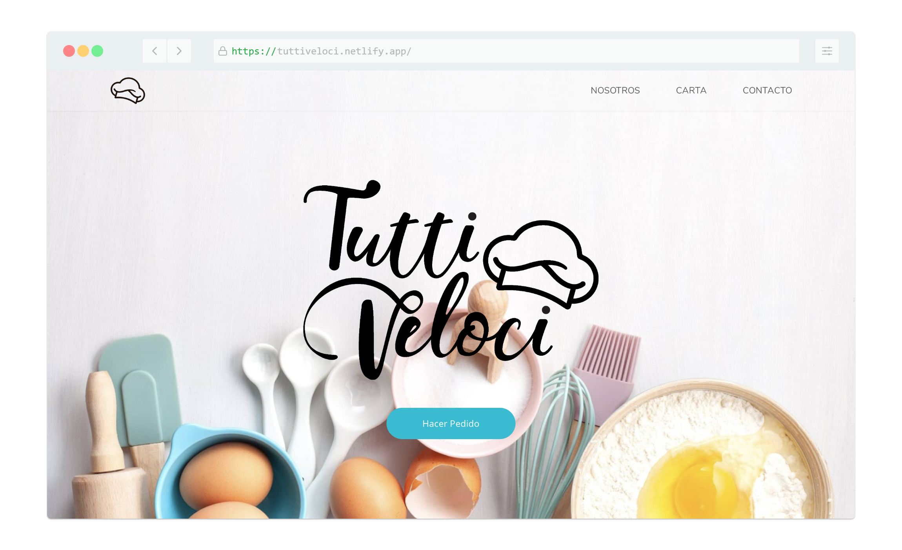

# Landing Site w/ Svelte + TailwindCSS + Storybook

## [Check it live here](https://tuttiveloci.netlify.app/)



A simple landing site made with Svelte + TailwindCSS + Storybook

## Getting Started

These instructions will get you a copy of the project up and running on your local machine for development and testing purposes. See deployment for notes on how to deploy the project on a live system.

### Prerequisites

You need to have  [nodejs](https://nodejs.org/) installed.

### Installing

Clone the Repository and run

```
npm install
npm run dev
```

To develop UI components independent of your app 

```
npm run stories
```


## Deployment

To deploy simply run

```
npm run build
```

## Built With

- [Svelte](https://svelte.dev/)
- [Tailwindcss](https://tailwindcss.com/)
- [Storybook](https://storybook.js.org/)

## Contributing

Please feel free to send pull request if you want to contribute!

## Authors

- **Carlos Amorós** - _Development_ - [Carlos Amorós](https://github.com/carlosz44)